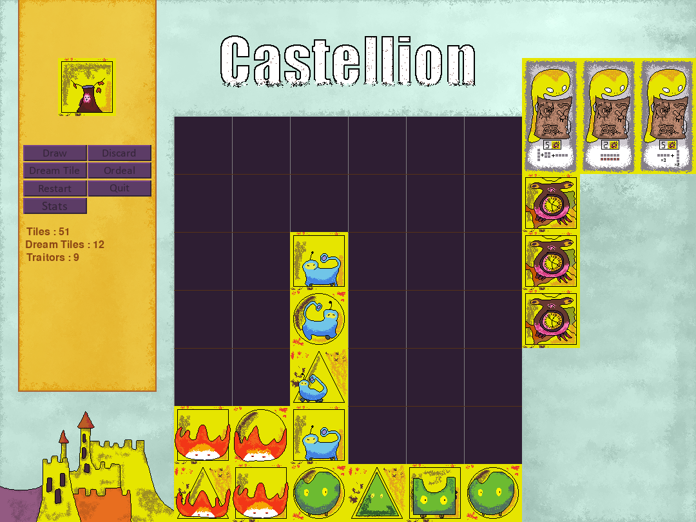
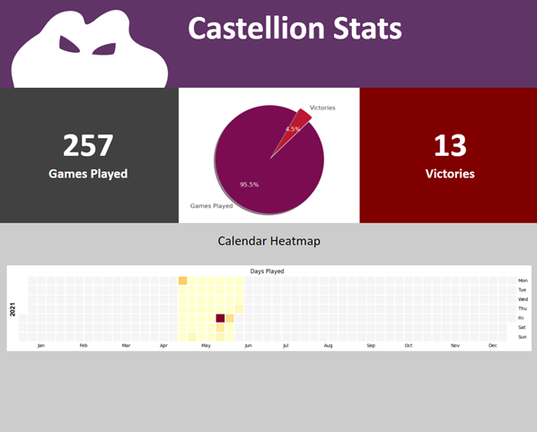
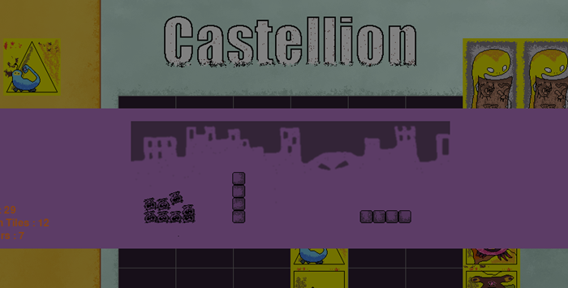

# python_castellion
Pygame version of the Castellion board game by [Z-Man Games](https://www.zmangames.com/en/products/castellion/) and designed by Shadi Torbey.

## Usage
Run main.py. The game assumes you know how to play. Rules can be found [here](https://images.zmangames.com/filer_public/78/95/7895a216-28e3-489d-92a4-b154dc376a77/zm4902_castellion_rules.pdf).

## Features

### Stats Page

 Clicking on "Stats" within the game will write an html file within the directory displaying stats on your games including total games played, win loss ratio, total wins, and a heatmap of days played.

 

### Ordeal Animation

View the minions attack your formations! 

## Bugs
As this was my first attempt at Pygame, there's lots of bugs. Many fixes on the horizon. Currently, the list stands at:

<li>1. Optionally engaging the first ordeal (clicking the "Ordeal" button) appears to report game over. Fix for this soon!</li>
<li>2. Invalid placement doesn't return the tile to its original spawn location.</li>
<li>3. Third ordeal doesn't trigger animation.</li>
 
It is possible to draw more than one 'tratior' tile in a row. While this isn't a bug, some may assume it is one.
